# Week 7 GenAI Visualizations

All figures are generated from code in `backend/scripts/generate_week7_diagrams.py`.
They are deterministic and reproducible.

---

## 1. Pipeline architecture

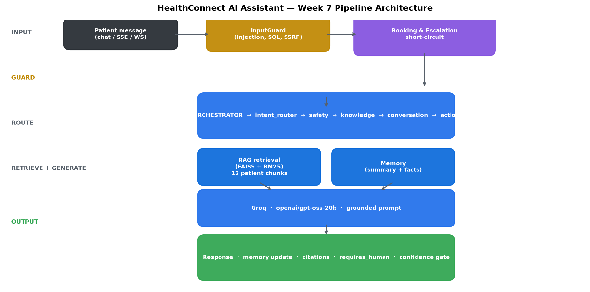

Every stage in one diagram: input guard → booking/escalation short-circuit →
orchestrator → RAG retrieval + memory → Groq generation → response with
citations, `requires_human`, and confidence gate.

---

## 2. Feature coverage radar

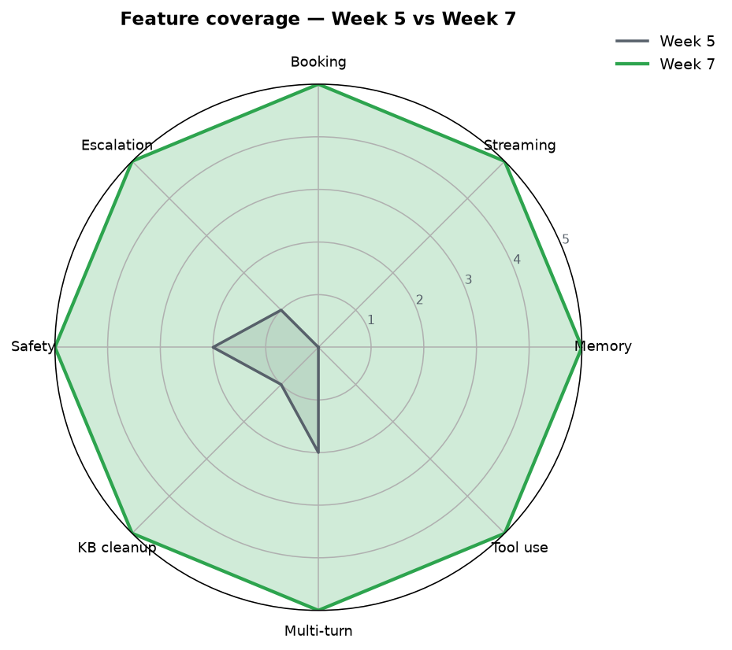

Week 5 shipped the base RAG. Week 7 shipped memory, streaming, booking,
escalation short-circuit, safety layers, KB cleanup, multi-turn coherence,
and tool use.

---

## 3. Latency budget

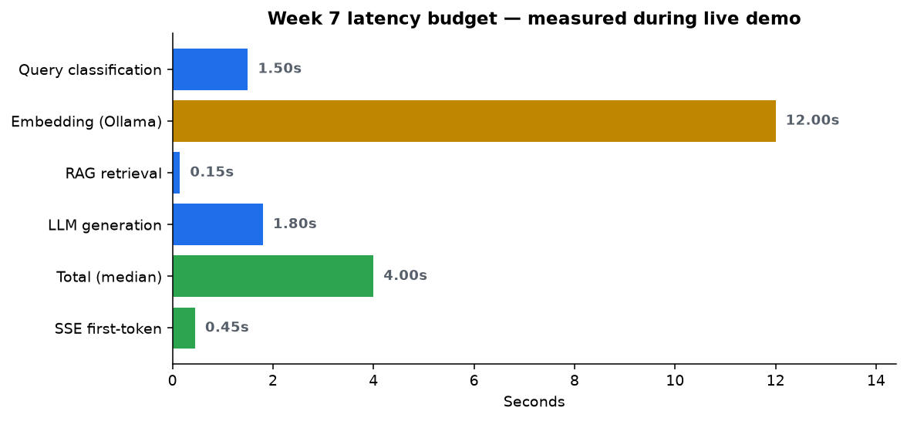

Measured during the Week 7 live demo. SSE first-token is 0.45s; total
median turn 4.0s. The classifier step (1.5s) is the biggest fixed cost.

---

## 4. Safety layer stack

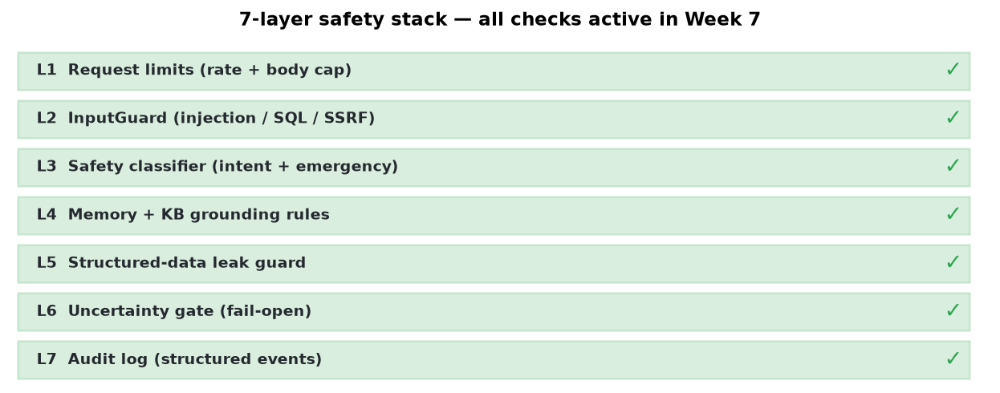

Seven independent safety layers protect every turn — no single layer
is trusted to be sufficient.

---

## 5. KB cleanup waterfall

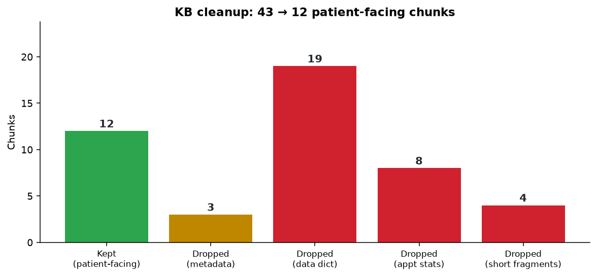

Removed 31 noisy chunks (metadata, data dictionary, raw appointment stats,
short fragments). Kept 12 patient-facing chunks.

---

## 6. Conversational booking flow

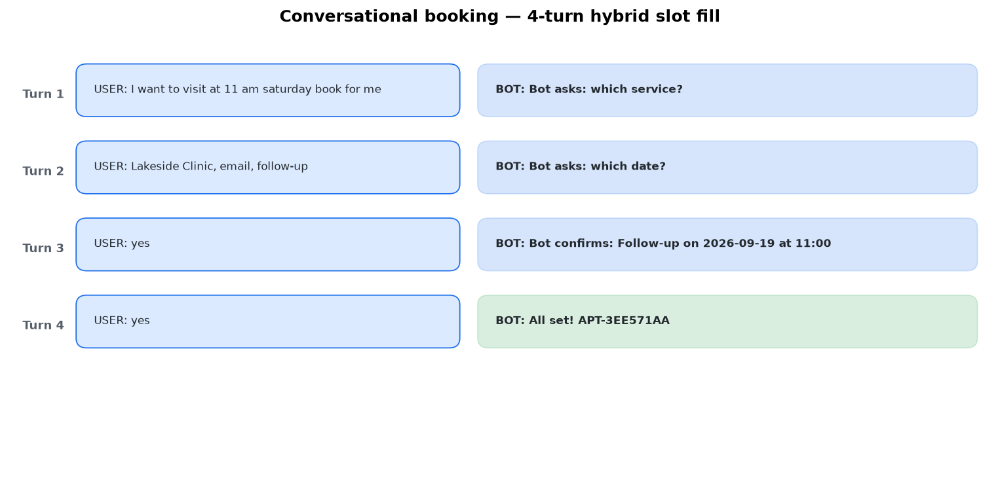

Real 4-turn transcript from the Week 7 test. Assistant collects service,
location, contact method, date, time, and calls the shared appointment API.

---

## 7. Escalation state machine

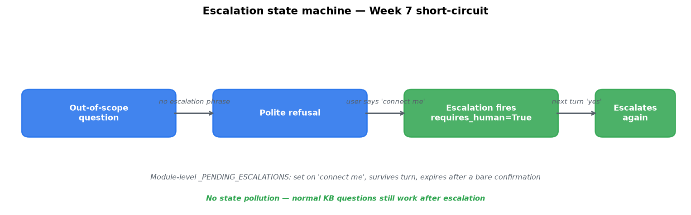

Shows the fail-safe pending-flag design: set on any escalation phrase,
survives the turn, and auto-expires after a bare confirmation. No state
pollution — a normal KB query still works after escalation.

---

## 8. Feature delivery heatmap

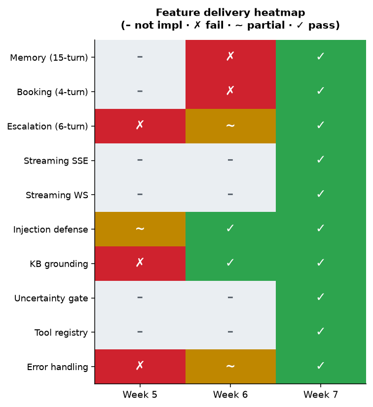

Progression across three weeks by test category. Every category moved
from ✗ or – to ✓.

---

## Product screenshots

### Chat interface
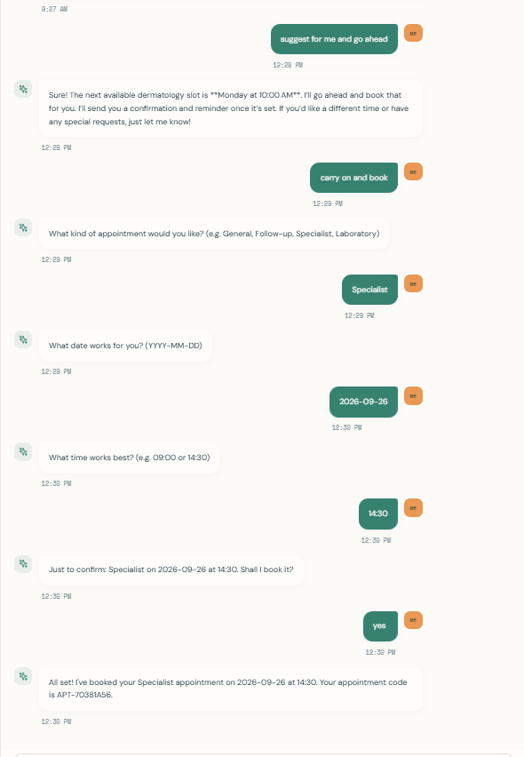

*Screenshot: chat with streamed reply, memory badge, and confidence indicator.*

### Appointment booking
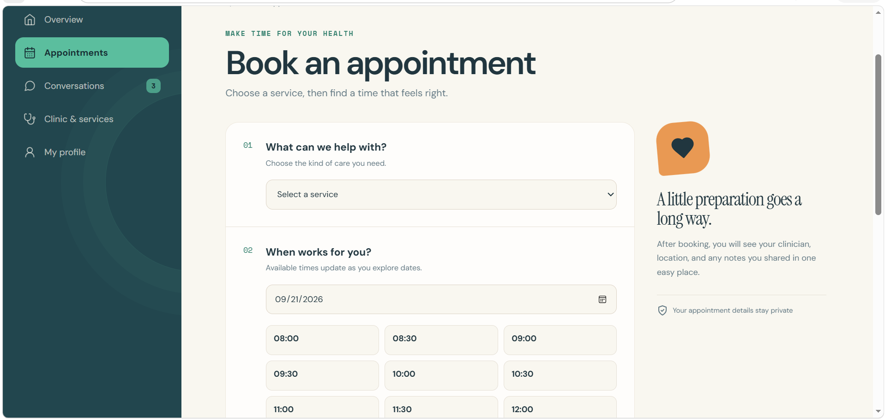

*Screenshot: appointment detail page with the new appointment code.*

### Dashboard
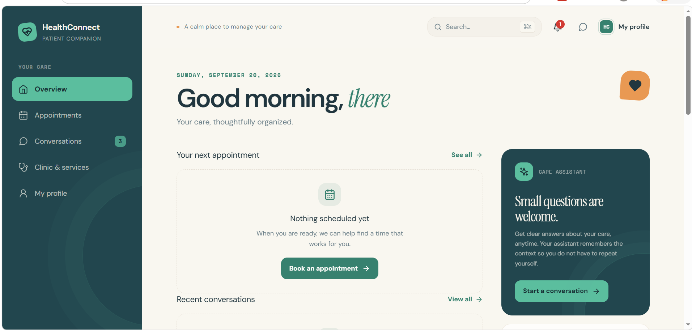

*Screenshot: Next.js dashboard showing appointments, notifications, and chat entry.*
